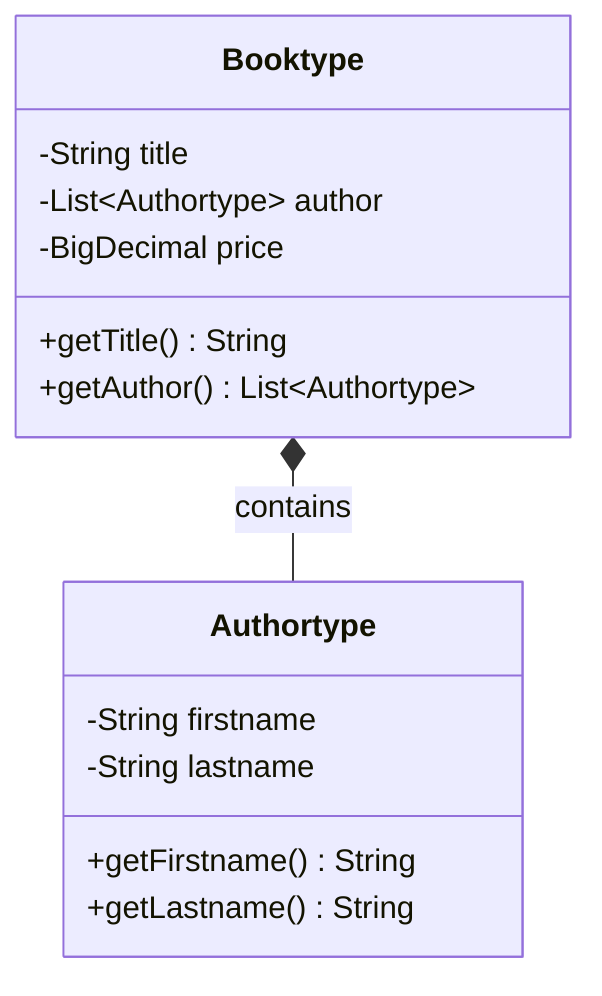

# How to View Generated UML Diagrams

This guide shows how to view the PlantUML (`.puml`) and Mermaid (`.mmd`) files generated by the Java UML Generator.

## PlantUML Files (.puml)

### Option 1: VS Code Extension (Recommended)
1. Install the **PlantUML** extension by jebbs
2. Open any `.puml` file
3. Press `Alt+D` or right-click → "PlantUML: Preview Current Diagram"
4. The diagram appears in a side panel

### Option 2: Online PlantUML Server
1. Go to: http://www.plantuml.com/plantuml/uml/
2. Copy the content from your `.puml` file
3. Paste into the text area
4. View the rendered diagram instantly

### Option 3: Command Line
```bash
# Install PlantUML (requires Java)
brew install plantuml  # macOS
sudo apt-get install plantuml  # Ubuntu

# Generate image
plantuml your_diagram.puml
# Creates your_diagram.png
```

## Mermaid Files (.mmd)

### Option 1: VS Code Extension
1. Install **Mermaid Preview** extension by vstirbu
2. Open any `.mmd` file
3. Right-click → "Mermaid: Preview Diagram"

### Option 2: Online Mermaid Live Editor (Best for Quick Viewing)
1. Go to: https://mermaid.live/
2. Copy content from your `.mmd` file
3. Paste and see instant rendering
4. Export as PNG, SVG, or PDF

### Option 3: GitHub Integration
Mermaid diagrams render automatically in:
- GitHub README files (just paste the content in markdown code blocks)
- GitHub wiki pages
- GitLab documentation

## Sample Embedding in Markdown

You can embed the generated diagrams directly in markdown files:

### PlantUML in Markdown
```markdown
```plantuml
@startuml
... (paste your .puml content here) ...
@enduml
```
```

### Mermaid in Markdown
```markdown
```mermaid
classDiagram
... (paste your .mmd content here) ...
```
```

## Quick Test

Try pasting this sample in https://mermaid.live/:



## Pro Tips

1. **VS Code Preview**: Install both PlantUML and Mermaid extensions for full support
2. **Export Options**: Online editors allow exporting to PNG, SVG, PDF
3. **Documentation**: Embed diagrams directly in your project documentation
4. **CI/CD**: Generate images automatically in build pipelines
